## Comandos
- Mova o jogador com as teclas W, A, S e D.
- A foto abaixo retrata o cenário do jogo. Os pedidos aparecem na parte superior da tela, e você deve entrar na área de seleção de ingredientes (vermelha) e pegar os ingredientes do pedido que você deseja preparar; depois, deve dirigir-se à área de preparação de pedidos (amarela) para obter o prato e, então, avançar para a área de entrega (azul) e selecionar o herói que deve receber o pedido em quesão. A expressão facial dos heróis reflete seu nível de satisfação com o tempo de espera, e quando se tornam bravos, estão prestes a desistir do pedido e ir embora.

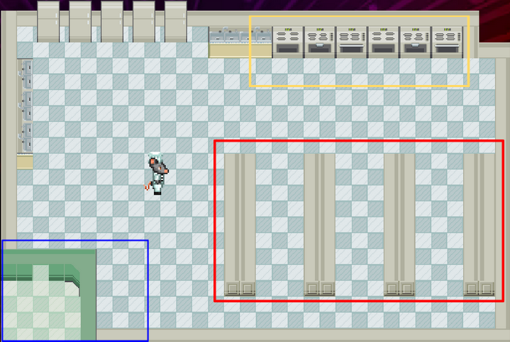

- Você pode selecionar os ingredientes, pratos e heróis nas três áreas usando o mouse ou então as setas (direta/esquerda) do teclado para mover o cursor sobre os botões e a tecla de espaço para confirmar a seleção.

## Pratos
A seguir, são listados os ingredientes que compõem cada um dos pratos do jogo:
1. 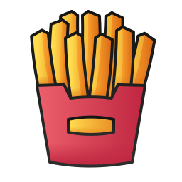 &rarr; 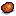
2. 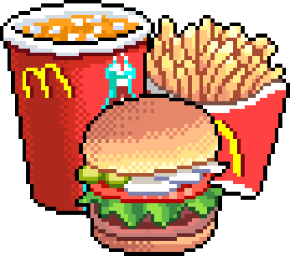 &rarr;     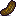   
3. 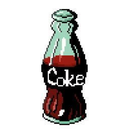 &rarr; 
4. 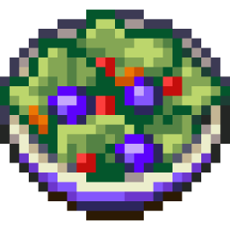 &rarr; 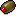  
5. 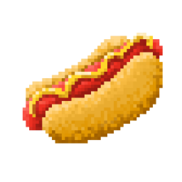 &rarr;   
6. 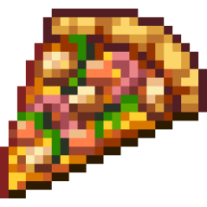 &rarr;    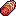  
